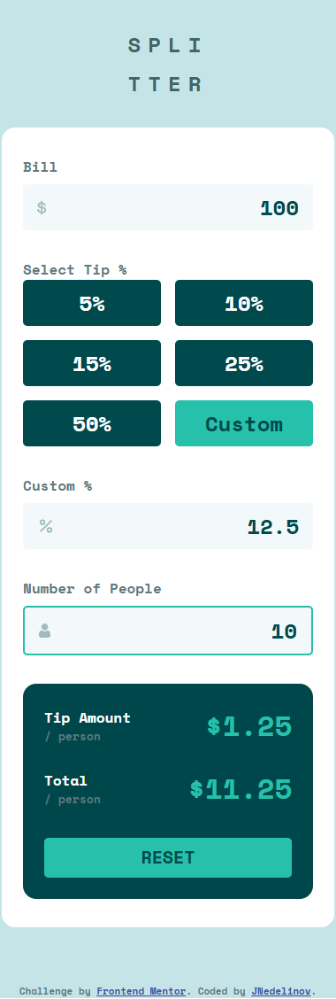
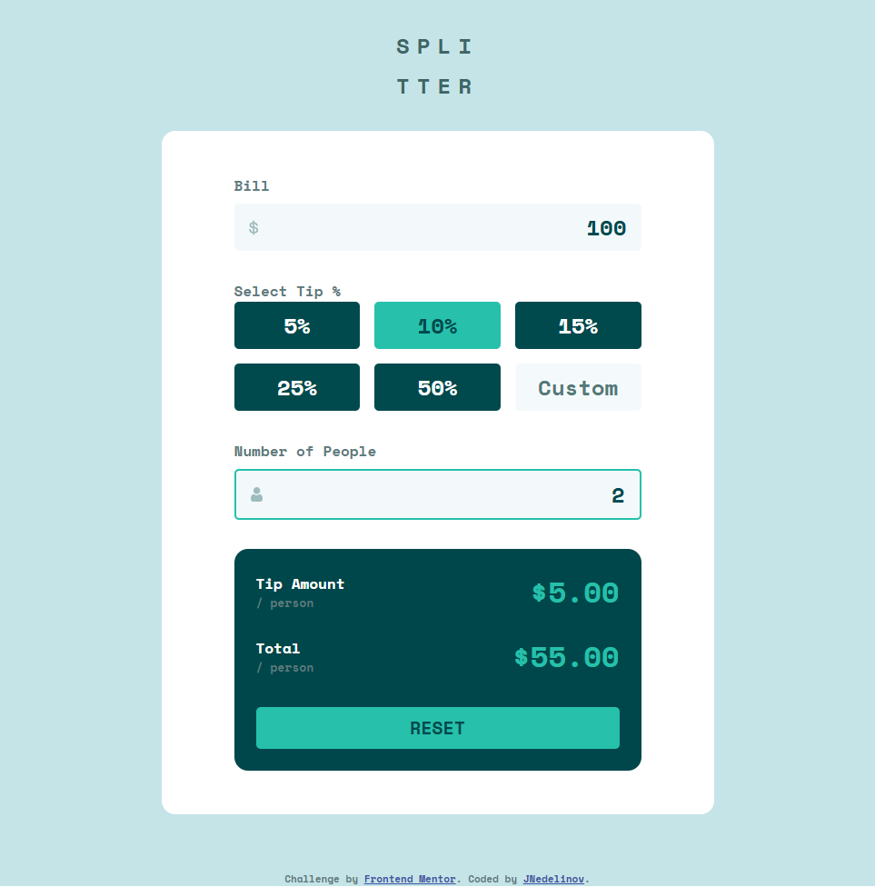
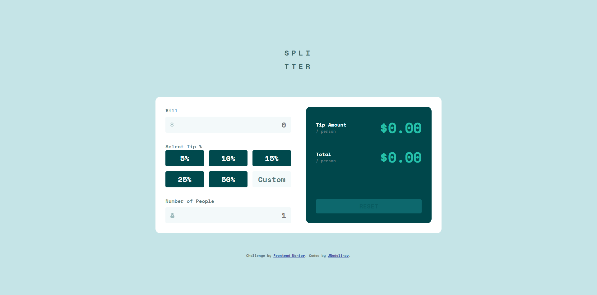
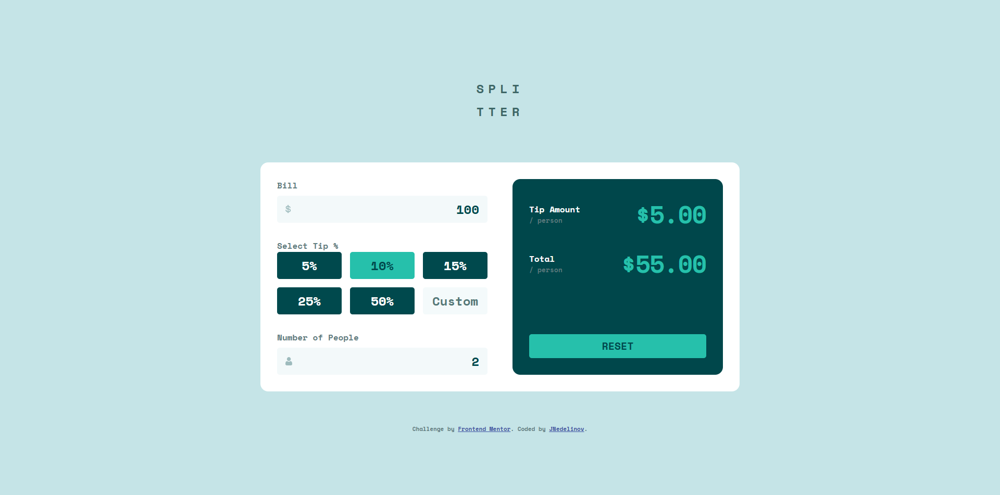
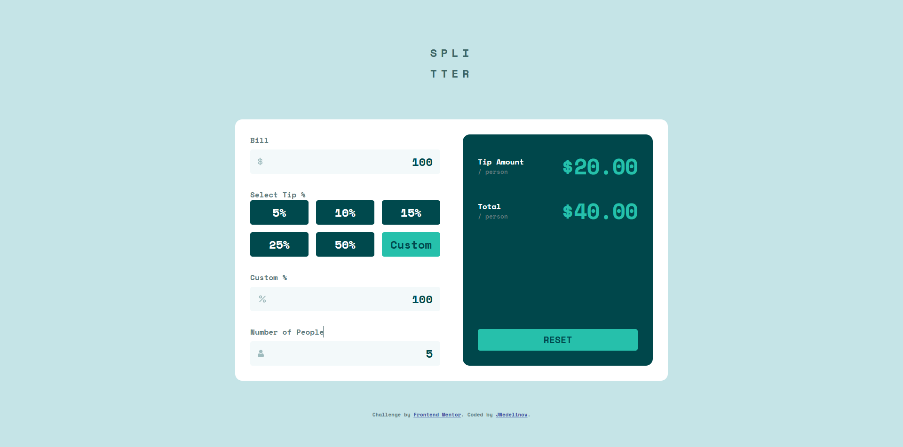
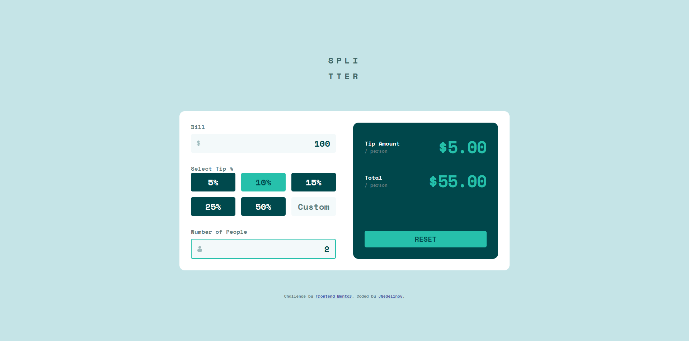

# Frontend Mentor - Tip calculator app solution

This is a solution to the [Tip calculator app challenge on Frontend Mentor](https://www.frontendmentor.io/challenges/tip-calculator-app-ugJNGbJUX).

## Table of contents

- [Frontend Mentor - Tip calculator app solution](#frontend-mentor---tip-calculator-app-solution)
  - [Table of contents](#table-of-contents)
  - [Overview](#overview)
    - [The challenge](#the-challenge)
    - [Screenshot](#screenshot)
    - [Links](#links)
  - [My process](#my-process)
    - [Built with](#built-with)
    - [What I learned](#what-i-learned)
    - [AI Collaboration](#ai-collaboration)
  - [Author](#author)

## Overview

### The challenge

Users should be able to:

- View the optimal layout for the app depending on their device's screen size
- See hover states for all interactive elements on the page
- Calculate the correct tip and total cost of the bill per person

### Screenshot

| Mobile                                 | Tablet                                  | Desktop                                 |
| :------------------------------------- | :-------------------------------------- | :-------------------------------------- |
|  |  |  |

| Desktop - Filled                               | Desktop - Custom Percentage Field             |
| :--------------------------------------------- | :-------------------------------------------- |
|  |  |

| Desktop - Error Handling (error)                       | Desktop - Error Handling (success)                             |
| :----------------------------------------------------- | :------------------------------------------------------------- |
|  |  |


### Links

- Solution URL: [here](https://github.com/JNedelinov/tip-calculator)
- Live Site URL: [here](https://jnedelinov-tip-calculator.netlify.app/)

## My process

### Built with

- Semantic HTML5 markup
- Mobile-first workflow
- Vanilla JS
- Less.js
- CSS Flexbox
- CSS Grid

### What I learned

**What I Learned: Native Browser Features & UI Polish**

Coming from a background of using libraries and frameworks (like React), building this project with vanilla HTML, CSS, and JavaScript opened my eyes to how much power the browser gives you right out of the box. I focused heavily on edge cases and UI polish, discovering several native features:
  - **Preventing "Ghost" Image Dragging**: I noticed that if a user clicks and drags an icon (like the dollar sign inside an input), it creates a messy "ghost" image attached to the cursor. I learned you can easily prevent this native behavior by adding the ```draggable="false"``` attribute directly to the `````` tag.

**Taming the** ```<input type="number">```: Number inputs have some quirky default behaviors that can ruin a user's experience if they aren't careful.

  - Disabling Scroll: If a user hovers over a number input and scrolls their mouse wheel, it unintentionally changes the value. I learned how to disable this by capturing the scroll event and preventing it (e.g., using ```onmousewheel="return false;"```).

  - Hiding Spin Buttons: I learned how to use browser-specific CSS pseudo-elements (```::-webkit-outer-spin-button``` and ```::-webkit-inner-spin-button```) and ```-moz-appearance``` to completely hide the default up/down arrows inside the input, resulting in a much cleaner, custom UI.

The ```:disabled``` CSS Pseudo-class: Instead of relying on JavaScript to manually add and remove an .```is-disabled``` class when a button shouldn't be clicked, I learned how to use the CSS ```:disabled``` pseudo-class. This natively links the button's visual styling to its actual HTML state, making the code cleaner and more semantic.

**JavaScript Memory: Mutating vs. Reassigning Objects (Pass by Value/Reference)**: 

  - I refreshed my understanding of how JavaScript handles objects passed into functions

  - If I mutate the parameter inside a function (e.g., ```parameter.property = 'new value'```), it changes the original object because I used the address to modify the "house."

  - However, if I reassign the parameter entirely (```e.g., parameter = { new: 'object' }```), it does not affect the original object outside the function. I merely erased the address on my function's copy of the paper and wrote down a new one.

### AI Collaboration

In this project, I used an AI assistant as a sounding board and mentor to help transition my knowledge of React/Redux architecture into Vanilla JavaScript. Instead of asking the AI to write my code, I used it to validate my approach and solidify foundational concepts:
  
  - **Vanilla JS Architecture**: I collaborated with the AI to map out how to structure my Vanilla JS into a clean Model-View-Controller (MVC) pattern, separating my state, UI rendering, and event handlers into ES6 modules.

  - **Exploring Native Behaviors**: When I discovered quirks with native HTML elements (like draggable images and number input scrollbars), I used the AI to confirm the best practices for handling them natively without relying on heavy external libraries.

  - **Deepening JavaScript Theory**: I used the AI to refresh my understanding of how JavaScript manages memory. We worked through the "house and paper" mental model to permanently grasp the difference between passing by reference (mutating an object) and passing by value (reassigning a variable).

## Author

- GitHub - [@JNedelinov](https://github.com/JNedelinov)
- Frontend Mentor - [@JNedelinov](https://www.frontendmentor.io/profile/JNedelinov)
- LinkedIn - [@Zhulien Zhivkov](https://www.linkedin.com/in/zhulien-zhivkov-493889119/)
